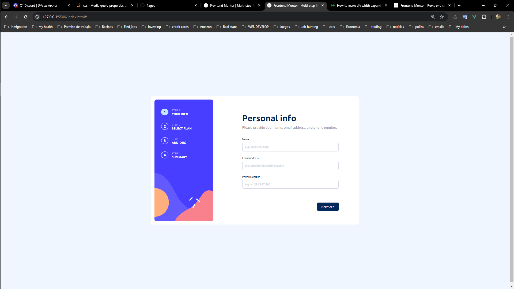

# Frontend Mentor - Multi-step form solution

This is a solution to the [Multi-step form challenge on Frontend Mentor](https://www.frontendmentor.io/challenges/multistep-form-YVAnSdqQBJ). Frontend Mentor challenges help you improve your coding skills by building realistic projects.

## Table of contents

- [Overview](#overview)
  - [The challenge](#the-challenge)
  - [Screenshot](#screenshot)
  - [Links](#links)
- [My process](#my-process)
  - [Built with](#built-with)
  - [What I learned](#what-i-learned)
  - [Continued development](#continued-development)
  - [Useful resources](#useful-resources)
- [Author](#author)
- [Acknowledgments](#acknowledgments)

**Note: Delete this note and update the table of contents based on what sections you keep.**

## Overview

### The challenge

Users should be able to:

- Complete each step of the sequence
- Go back to a previous step to update their selections
- See a summary of their selections on the final step and confirm their order
- View the optimal layout for the interface depending on their device's screen size
- See hover and focus states for all interactive elements on the page
- Receive form validation messages if:
  - A field has been missed
  - The email address is not formatted correctly
  - A step is submitted, but no selection has been made

### Screenshot

### Links

- Solution URL: [https://github.com/henryapm/multi-step-form](https://your-solution-url.com)
- Live Site URL: [https://henryapm.github.io/multi-step-form/](https://your-live-site-url.com)

## My process

### Built with

- Semantic HTML5 markup
- CSS custom properties
- Flexbox
- Mobile-first workflow(I started with desktop version but transition into mobile last)
- [vue](https://vuejs.org/) - JS library

### What I learned

From this project I learned a lot of things, from getting more used to flexbox, to use in a basic level a javascriptframework like Vuejs.

### Continued development

I would like to keep learning more about Vuejs and its uses in frontend development, in second place I'd like to keep developing my skills translating figma files into css and html, is very fun and feels good to be able to do such thing.

### Useful resources

- [resource 1](https://www.vuemastery.com/) - This helped me to understand the basics of vue js.

## Author

- Website - [Henry](https://henryapm.github.io/)
- Frontend Mentor - [@henryapm](https://www.frontendmentor.io/profile/henryapm)

## Acknowledgments

I want to thank Alex, is a friend I met in frontend mentor, we both have been pushing each other to get to our goals, and he definitely helped me getting through this by giving me tips and supporting me.
